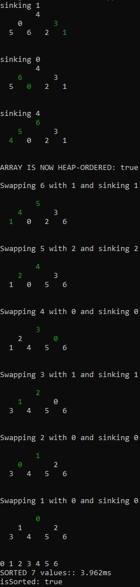

#Terminal heapsort visualizer in JS

This is a handy heapsort visualizer

As heapsort requires many lines to visualize, you may need to increase your terminal height. On WSL2 / Ubuntu, right click title bar > properties > layout > screen buffer size > height. Verbose heapsort of an array length 63 prints 905 lines 

To see one heapsort, `node exec.js`

To change colors to high contrast, `node exec.js 1`: you can pass literally anything, it's not very clever

Change array length in `exec.js`: I recommend powers of 2 minus 1 e.g. 15, 31, 63, but any will work.

#TODO:

-benchmark file

-benchmark file stringbuilder in exec

-Improve argument handling

#SAMPLE OUTPUT:

